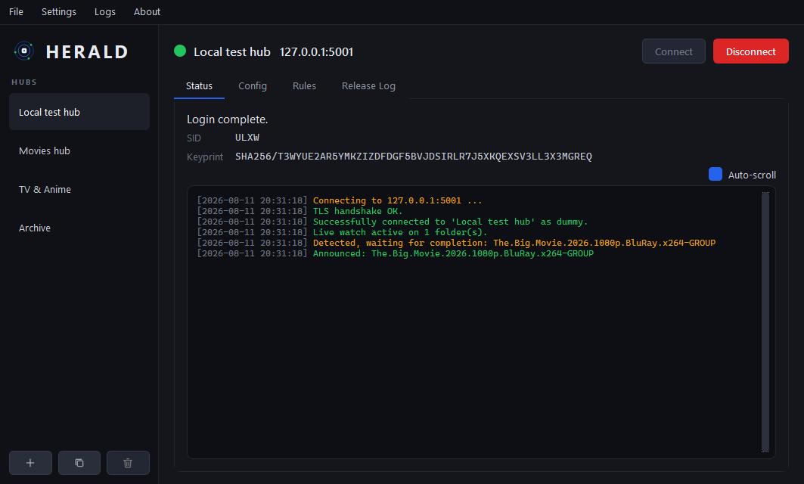

<p align="center">
  <picture>
    <source media="(prefers-color-scheme: light)" srcset="assets/herald-logo-light.svg">
    
  </picture>
</p>


<p align="center">
  <a href="LICENSE"></a>
  
  
  <a href="https://github.com/luadch-ng/herald/releases/latest"></a>
  <a href="https://github.com/luadch-ng/herald/pkgs/container/herald"></a>
</p>

Herald - A multihub **ADC release announcer** for the [Direct Connect](https://dcvault.net/docs/basics/what-is-direct-connect)
network, built for [luadch-ng](https://github.com/luadch-ng/luadch-ng) hubs. It
watches folders for finished releases and announces them to one or more hubs.
One config, two front-ends: a **Qt GUI** for the desktop and a **headless CLI**
(no Qt) for servers and Docker.


<p align="center">
  
</p>

## Features

- 📡 Multihub - announce to many hubs at once, each its own connection
- 🔐 Full ADCS support
- 🧠 Completion detection - (SFV / size-stable / CRC modes)
- 🧩 Per-rule filters - exclude/include terms, NFO/SFV required, hidden-file skip,
  max age, daydir (MMDD) scheme with a midnight grace window
- 🖥️ Modern Qt GUI - dark + light theme, per-hub Status/Config/Rules/Release tabs
- 🐍 Headless CLI - the `adc/` engine imports zero Qt; runs on a bare server
- 📥 Import - migrate an old Lua-announcer config + freshstuff categories
- 🔔 Update notification - checks GitHub for a newer release (notify-only, opt-out)
- 🐳 Docker image for the headless runner

## Quick Start

### GUI (desktop)

Grab the Windows build from the [latest release](https://github.com/luadch-ng/herald/releases/latest),
unzip, run `Herald.exe`. Config persists in a portable `data/` folder next to
the executable.

Or run from source (any OS with Python 3.10+):

```bash
pip install -r requirements.txt          # PySide6 + numpy
python main.py
```


### Headless / CLI (server, Docker)

The engine needs no GUI. Configure hubs + rules once in the GUI (they persist to
`data/hubs.json`), then run them headless:

```bash
pip install -r requirements-core.txt     # no PySide6/Qt
python herald_cli.py --list              # configured hubs + enabled state
python herald_cli.py --check             # validate config + watch paths here
python herald_cli.py                     # run every ENABLED hub (Ctrl-C stops)
```

### Docker (CLI)

```bash
docker run -d --name herald \
  -v /path/to/herald-data:/app/data \
  -v /path/to/releases:/releases:ro \
  ghcr.io/luadch-ng/herald:latest
```

Put the `data/` folder you configured with the GUI (with `Settings -> Target
runtime OS = Linux` and the rules' watch paths as they are inside the container)
into the mounted volume. See [`docker-compose.yml`](docker-compose.yml) for a
full example, or [`deploy/herald.service`](deploy/herald.service) for a systemd
unit instead of Docker.

**Cross-OS configs:** watch paths must be valid on the machine that RUNS the
engine. Configure on Windows but deploy on Linux? Open **Settings -> Target
runtime OS**, pick `Linux`, then enter the paths as they are on the server.
`herald_cli.py --check` reports any that are missing there.


## Configuration

Everything is configured in the GUI and stored in a portable `data/` folder next
to the app (the headless runner reads the same files). See
**[docs/CONFIGURATION.md](docs/CONFIGURATION.md)** for the hub, rule and global
settings, plus the cross-OS / Docker watch-path notes.

## Credits

Part of the [luadch-ng](https://github.com/luadch-ng/luadch-ng) project. The ADC
core (Tiger, base32, HPAS) is ported from luadch's `adclib`.

A special thank you to [@Sopor](https://github.com/Sopor) for the extensive live
testing and feature suggestions.

## AI-Transparency

This project uses Claude Code to help with analysing, planning, and writing code.

## License

GPLv3.0 - see [LICENSE](LICENSE).
